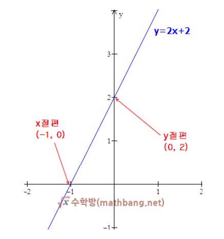
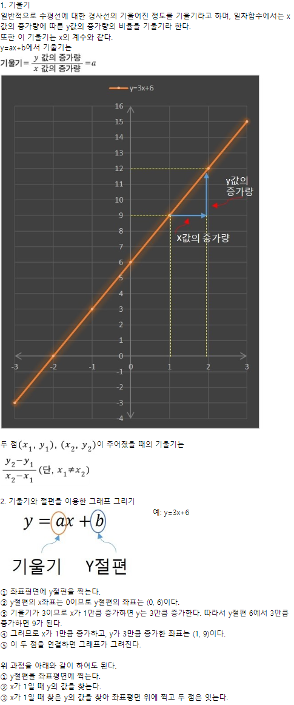

# 05월 30일 학습내용

1. X 절편 : 그래프가 X 축과 만나는 점의 X 좌표를 X 절편  
    - 다른 말로 Y= 0 일 때의 X값   

2. Y 절편 : 그래프가 y 축과 만나는 점의 Y 좌표를 Y 절편  
    - 다른 말로 X= 0 일 때의 Y값
- x 절편: y = 2x + 2 : 0 = 2x + 2,　2x =2,　x = -1,  
y = 0일 때 x의 값은 "-1" 
- y 절편: y = 2x + 2 : 0 = 2x + 2,　y= 2,  
    x = 0일 때 y의 값은 "2"  

  
https://mathbang.net/46#gsc.tab=0  

https://m.blog.naver.com/PostView.naver?isHttpsRedirect=true&blogId=sontrm&logNo=220649131620

corr(method='pearson) : 피어슨 상관계수 : 두 변수의 선형 상관계수를 의미(default)  
corr(method='spearman'): 스피어먼 상관계수 : 두 변수의 순위의 피어슨 상관계수를 의미  
corr(method='kendall') : 켄달-타우 상관계수 : 두 순위간의 상관 계수를 의미  

